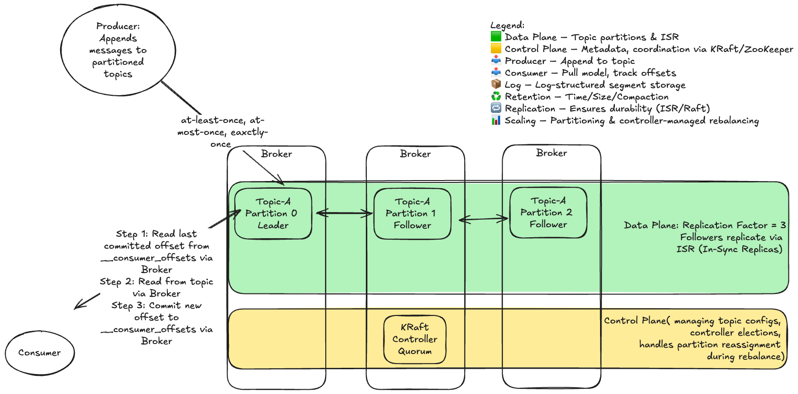

# Kafka Architecture Design Summary

This document summarizes the design of a modern Apache Kafka deployment, including core architecture components, operational semantics, and system behaviors. The accompanying diagram visually separates the **Data Plane** (message flow and storage) from the **Control Plane** (cluster coordination and metadata management), while capturing essential concepts like replication, retention, and scaling.

---

## 🧱 Components

### 🟢 Data Plane (Topic Partitions & ISR)
- **Producers** append messages to partitioned topics based on keys or round-robin strategies.
- Each partition is replicated across multiple brokers using **In-Sync Replicas (ISR)** to ensure durability.
- **Consumers** pull messages from partitions and track offsets manually or automatically, with support for:
    - At-least-once delivery (default)
    - Exactly-once semantics (when configured)
- Message delivery guarantees depend on `acks`, idempotence, and offset handling strategies.

### 🟡 Control Plane (Metadata, Coordination)
- Managed using **KRaft** (Kafka Raft mode) or legacy **ZooKeeper**.
- Responsibilities include:
    - Broker registration and controller election
    - Partition leadership assignments
    - Rebalancing partitions during broker changes or topic updates
    - Managing topic metadata and configurations
- In KRaft, metadata is stored in an internal Raft log and replicated among a quorum of controllers.

---

## 🗃 Storage Model

Kafka uses a **log-structured storage system**:
- Each partition is an append-only log segmented into multiple files.
- Older log segments are:
    - **Sealed** (no longer written to)
    - **Compressed** (depending on broker configuration)
- This structure enables fast sequential writes and efficient disk IO.

---

## 🕒 Retention Policies

Kafka supports per-topic retention configuration:
- **Time-based** retention (e.g., 7 days)
- **Size-based** retention (e.g., 10 GB)
- **Log compaction** to retain the latest message per key (useful for changelog-style topics)

---

## 🔁 Durability and Replication

- Kafka ensures data durability via replication across brokers:
    - **ISR** replicates partition logs to follower brokers.
    - A write is considered committed when it reaches all in-sync replicas (depending on `acks=all`).
- For metadata, **Raft consensus** is used (in KRaft mode) to maintain consistency and fault tolerance.

---

## 📈 Scalability and Partitioning

- Kafka scales horizontally by partitioning topics across brokers.
- Each partition has one leader and multiple followers.
- The **Kafka controller** (part of the control plane) dynamically reassigns partitions during:
    - Broker joins/leaves
    - Topic reconfiguration
    - Partition rebalancing events

---

## 📋 Summary of Flow

1. **Producer** sends messages to a topic partition (based on partitioner logic).
2. **Broker leader** appends to local log and replicates to ISR followers.
3. **Consumer** fetches offset from `__consumer_offsets`, pulls messages, and commits new offsets.
4. **KRaft controller quorum** manages metadata and coordination.

---

## 🧭 Legend (from Diagram)

- 🟢 Data Plane – Topic partitions & ISR
- 🟡 Control Plane – Metadata, coordination via KRaft/ZooKeeper
- 📨 Producer – Append to topic
- 📬 Consumer – Pull model, track offsets
- 📦 Log – Log-structured segment storage
- ♻️ Retention – Time/Size/Compaction
- 🔁 Replication – Ensures durability (ISR/Raft)
- 📊 Scaling – Partitioning & controller-managed rebalancing

---

## Notes
- This design assumes **Kafka 3.3+** with **KRaft mode enabled** (ZooKeeper-free architecture).
- Legacy deployments may still use ZooKeeper for controller election and metadata storage.

---

## 📊 Architecture Diagram

You can edit this diagram by uploading the PNG to [Excalidraw](https://excalidraw.com).